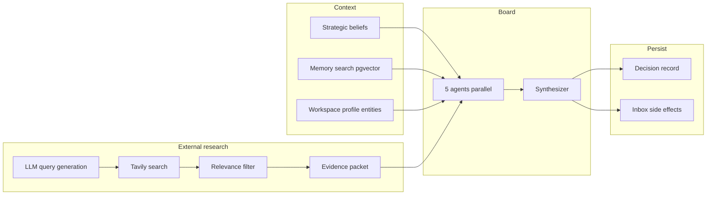

# HelmOS v2

**Founder Intelligence Operating System** — *evidence before confidence.*

HelmOS helps solo founders make strategic calls with adversarial AI review, grounded memory, and live web research. The founder always decides; the system supplies analysis, evidence, and a persistent decision record — never autonomous action.

---

## Real-world use case

A founder running one or two ventures (e.g. a B2B SaaS and a second product line) faces constant strategic questions:

- *Should we prioritize this enterprise prospect above our ICP?*
- *Is this partnership worth the distraction?*
- *What did we believe last quarter, and does new evidence change that?*

HelmOS replaces scattered notes, ChatGPT threads, and gut feel with:

1. **Doctrine** — strategic beliefs always in context (not buried in docs)
2. **Memory** — searchable notes, uploads, research summaries, prior decisions
3. **Board** — five specialized agents debate the question; synthesis produces a verdict, confidence, and next action
4. **Research** — Tavily + optional Firecrawl for fresh external evidence on board runs
5. **Decision log + inbox** — outcomes persist; conflicts and open items surface for founder action

Seed workspaces demonstrate the pattern:

| Workspace | Domain | Example question |
|-----------|--------|------------------|
| **Clawback Labs** | Payroll clawback recovery for mid-market employers | *Should we pursue Acme Corp (~2,400 employees) despite our 1,500-employee ICP ceiling?* |
| **NexOps** | Operations intelligence SaaS | *Should we launch self-serve onboarding for pilot customers?* |

---

## Features

| Feature | What it does |
|---------|----------------|
| **Dashboard** | Mission control: today's focus, active decisions, board alerts, opportunities |
| **Intel Brief (chat)** | Streaming Q&A over beliefs + retrieved memory chunks |
| **Board review** | 5-agent adversarial session with **Decision** or **Exploration** mode |
| **Knowledge (memory)** | Notes, file ingest (PDF), entity profiles, research summaries |
| **Beliefs** | Founding doctrine with confidence, rationale, and override conditions |
| **Entities** | Company / partner cards linked to decisions and research |
| **Decisions** | Persistent log with verdict, confidence, evidence score, timeline |
| **Inbox** | Attention queue: conflicts, unresolved decisions, blocked actions |
| **Entity research jobs** | Async Tavily/Firecrawl pipeline for target companies |
| **Context trace (debug)** | Observability for memory retrieval, research hits, and researcher LLM output |

### Board agents

| Agent | Role | Default model |
|-------|------|----------------|
| **Researcher** | Evidence-only report from external research packet | `anthropic/claude-sonnet-4` |
| **Skeptic** | Prove the board wrong; challenge beliefs as heuristics | `anthropic/claude-sonnet-4` |
| **Operator** | Bandwidth, execution risk, time-to-value | `openai/gpt-4o-mini` |
| **Sales Strategist** | ICP fit, outreach, conversion, credibility | `openai/gpt-4o-mini` |
| **CTO** | Technical feasibility, integration, scalability | `openai/gpt-4o-mini` |
| **Synthesizer** | Merges agent outputs into one recommendation | `anthropic/claude-sonnet-4` |

Per-agent models are overridable via `BOARD_AGENT_MODELS` JSON or `BOARD_AGENT_MODEL_*` env vars.

### Board modes

- **Decision** — founder needs a pick. Agents must lean **for / against / conditional**; synthesis answers the question directly first.
- **Exploration** — open analysis; `needs_research` allowed when evidence is thin.

---

## Architecture

```text
┌─────────────────────────────────────────────────────────────────────────┐
│  Next.js 14 (apps/frontend)                                             │
│  Dashboard · Board · Chat · Memory · Decisions · Inbox · Research       │
└───────────────────────────────┬─────────────────────────────────────────┘
                                │ REST + SSE
                                ▼
┌─────────────────────────────────────────────────────────────────────────┐
│  FastAPI (apps/backend) — Render                                        │
│  ┌─────────────┐  ┌──────────────────┐  ┌─────────────────────────────┐ │
│  │ API routes  │  │ Board orchestrator│  │ Agents + synthesizer       │ │
│  └─────────────┘  │ (imperative or     │  └─────────────────────────────┘ │
│                   │  LangGraph flag)   │                                  │
│                   └─────────┬──────────┘                                  │
│                             │                                             │
│  ┌──────────────────────────┼──────────────────────────────────────────┐  │
│  │ BeliefService · MemoryService · Research pipeline · Spend cap      │  │
│  └──────────────────────────┼──────────────────────────────────────────┘  │
└─────────────────────────────┼─────────────────────────────────────────────┘
                              │
        ┌─────────────────────┼─────────────────────┐
        ▼                     ▼                     ▼
┌───────────────┐   ┌─────────────────┐   ┌──────────────────┐
│ Supabase PG   │   │ Supabase Storage │   │ External APIs      │
│ + pgvector    │   │ (helmos-files)   │   │ OpenRouter         │
│               │   │                  │   │ Tavily · Firecrawl │
└───────────────┘   └─────────────────┘   └──────────────────┘
```

### Board session flow



### Beliefs vs memory (critical)

| | **Beliefs** | **Memory** |
|---|-------------|------------|
| **Storage** | `strategic_beliefs` table | `memory_chunks` + pgvector embeddings |
| **Retrieval** | Always packed into prompts | Semantic search (vector → text → recent fallback) |
| **Purpose** | Founding doctrine, override conditions | Operational context: notes, docs, research, logs |
| **UI** | Beliefs panel | Memory / Knowledge view |

Beliefs are **heuristics**, not laws — the Skeptic and synthesizer are prompted to challenge them when evidence warrants an exception.

### AI stack

| Layer | Implementation |
|-------|----------------|
| **LLM** | OpenRouter (`openai` SDK + LangChain adapter) |
| **Embeddings** | `openai/text-embedding-3-small` via OpenRouter |
| **Structured output** | LangChain `with_structured_output` for query gen + researcher |
| **Orchestration** | Imperative `asyncio` (default) or **LangGraph** when `USE_LANGGRAPH_BOARD=true` |
| **Research** | Tavily search → relevance scoring → optional Firecrawl scrape → LLM summaries |

---

## Metrics and observability

HelmOS surfaces quantitative signals so founders (and developers) can judge quality, not just read prose.

### Per decision / board session

| Metric | Meaning |
|--------|---------|
| `confidence` | Synthesis confidence (0.0–1.0) |
| `evidence_score` | How well the session is supported by evidence (0.0–1.0) |
| `verdict` | `lean_for` · `lean_against` · `conditional` · `needs_research` |
| `unknowns_level` | `high` · `moderate` · `low` |
| `influence_weight` | Per-agent weight in synthesis (e.g. Researcher 0.4) |

### Context trace (board debug panel)

Returned on synthesis `context_trace`:

| Field | Meaning |
|-------|---------|
| `beliefs_count` | Active beliefs injected |
| `memory.retrieved_chunks_count` | Chunks passed to agents |
| `memory.vector_hits` / `text_hits` | Which retrieval path fired |
| `research.tavily_hits` | Raw Tavily results |
| `research.relevant_hits` | After relevance filter |
| `research.passed_to_researcher` | Sources in evidence packet |
| `research.retrieval_case` | `none` · `no_sources` · `no_relevant` · `has_relevant` |
| `researcher.raw_response` | Researcher LLM output for debugging |

### Cost controls

- `DAILY_SPEND_CAP_USD` (default `5.00`) — board research blocked when exceeded
- Spend tracked in `spend_ledger` by category (`board_research`, etc.)

### Founder state bar

`GET /founder-state` exposes aggregate load: open decisions, blocked inbox items, research needed.

---

## Repository structure

```text
HelmOS-v2/
├── apps/
│   ├── frontend/          # Next.js 14, Tailwind, shadcn/ui
│   │   ├── app/workspace/[workspaceId]/   # Dashboard, Board, Chat, …
│   │   ├── components/      # board, chat, dashboard, shell, …
│   │   └── lib/             # API client, types, stores
│   └── backend/           # FastAPI
│       ├── agents/          # Board agents, prompts, modes
│       ├── orchestrator/    # board.py, context_builder, graphs/
│       ├── research/        # board_evidence, query_generator, relevance
│       ├── memory/          # retrieval, ingestion
│       ├── beliefs/         # BeliefService
│       ├── llm/             # openrouter, langchain_client, agent_models
│       └── tests/           # pytest (45+ tests)
├── supabase/
│   ├── migrations/        # schema + pgvector + belief metadata
│   └── seed.sql             # demo workspaces
└── docs/                    # setup, deploy, UX handover
```

---

## Quick start

### Prerequisites

- Node 18+, pnpm
- Python 3.11+
- Supabase project ([setup guide](docs/supabase-setup.md))

### 1. Database

Run migrations in order, then seed:

```bash
# supabase/migrations/*.sql → SQL Editor or supabase db push
# supabase/seed.sql
```

Create a private Storage bucket: `helmos-files`.

### 2. Backend

```bash
cd apps/backend
pip install -r requirements.txt
cp ../../.env.example .env   # fill DATABASE_URL, keys
uvicorn main:app --reload --port 8000
```

### 3. Frontend

```bash
cd apps/frontend
pnpm install
cp .env.local.example .env.local
```

For live API (not mocks):

```env
NEXT_PUBLIC_USE_MSW=false
NEXT_PUBLIC_API_BASE_URL=http://localhost:8000
NEXT_PUBLIC_HELMOS_API_KEY=dev-key
```

```bash
cd ../..
pnpm install
pnpm dev
```

Open [http://localhost:3000](http://localhost:3000) → redirects to **Clawback Labs** dashboard.

| Workspace | URL |
|-----------|-----|
| Clawback Labs | `/workspace/clawback-labs/dashboard` |
| NexOps | `/workspace/nexops/dashboard` |

---

## Configuration

Copy [`.env.example`](.env.example) → `apps/backend/.env`.

| Variable | Purpose |
|----------|---------|
| `DATABASE_URL` | Supabase Postgres pooler (`postgresql+asyncpg://…`) |
| `OPENROUTER_API_KEY` | LLM + embeddings (required for board/chat) |
| `TAVILY_API_KEY` | Board external research |
| `FIRECRAWL_API_KEY` | Optional deep page extract |
| `HELMOS_API_KEY` | API auth (`dev-key` locally) |
| `CORS_ORIGINS` | Frontend origins (include `:3001` if port busy) |
| `DAILY_SPEND_CAP_USD` | Cost guardrail |
| `USE_LANGGRAPH_BOARD` | `true` to use LangGraph orchestration |
| `BOARD_AGENT_MODELS` | JSON map of per-agent models |

---

## API overview

Full contract: [apps/frontend/docs/api-contract.md](apps/frontend/docs/api-contract.md)

| Area | Key endpoints |
|------|----------------|
| Health | `GET /health` |
| Mission control | `GET /dashboard`, `GET /founder-state` |
| Workspaces | `GET /workspaces`, `GET /workspaces/:id/profile` |
| Beliefs | `GET/POST/PATCH/DELETE /beliefs` |
| Memory | `GET/POST /memory/chunks`, `POST /memory/ingest` |
| Chat | `POST /chat/stream` (SSE) |
| Board | `POST /board/sessions`, `GET /board/sessions/:id` |
| Decisions | `GET/PATCH /decisions` |
| Inbox | `GET/PATCH /inbox` |
| Research jobs | `POST /research/run`, `GET /research/status/:id` |

Auth: `Authorization: Bearer <HELMOS_API_KEY>` on all routes except `/health`.

Interactive docs: `http://localhost:8000/docs`

---

## Testing

```bash
cd apps/backend
python -m pytest tests/ -q
```

Covers board modes, agent prompts, memory retrieval fallback, research relevance, LangChain client, LangGraph flows, and board evidence steps.

---

## Deployment

- **API:** [docs/render-deploy.md](docs/render-deploy.md) (Render)
- **Database / storage:** Supabase (no local Postgres)
- **Frontend:** Vercel or any Next.js host — set `NEXT_PUBLIC_API_BASE_URL` to Render URL

---

## Documentation

| Doc | Contents |
|-----|----------|
| [UX handover](docs/ux-handover.md) | User flows, IA, pain points, refactor guidance |
| [API contract](apps/frontend/docs/api-contract.md) | REST + SSE shapes |
| [Supabase setup](docs/supabase-setup.md) | Migrations, pooler URL, pgvector |
| [Render deploy](docs/render-deploy.md) | Production env vars |
| [Backend README](apps/backend/README.md) | Beliefs vs memory, auth |

---

## Keyboard shortcuts

| Shortcut | Action |
|----------|--------|
| `Cmd/Ctrl+D` | Dashboard |
| `Cmd/Ctrl+B` | Board review |
| `Cmd/Ctrl+R` | Research |
| `Cmd/Ctrl+I` | Inbox / Attention |

---

## Design principles

1. **Human-in-the-loop** — Accept, Defer, or Push Back on board outcomes
2. **Evidence before confidence** — scores and sources visible; abstention discouraged in Decision mode
3. **Beliefs are heuristics** — agents may argue for justified exceptions
4. **Workspace-scoped** — each venture has isolated beliefs, memory, and decisions
5. **No dark patterns** — no fake urgency; founder owns the final call

---

## License

Private — HelmOS v2.
