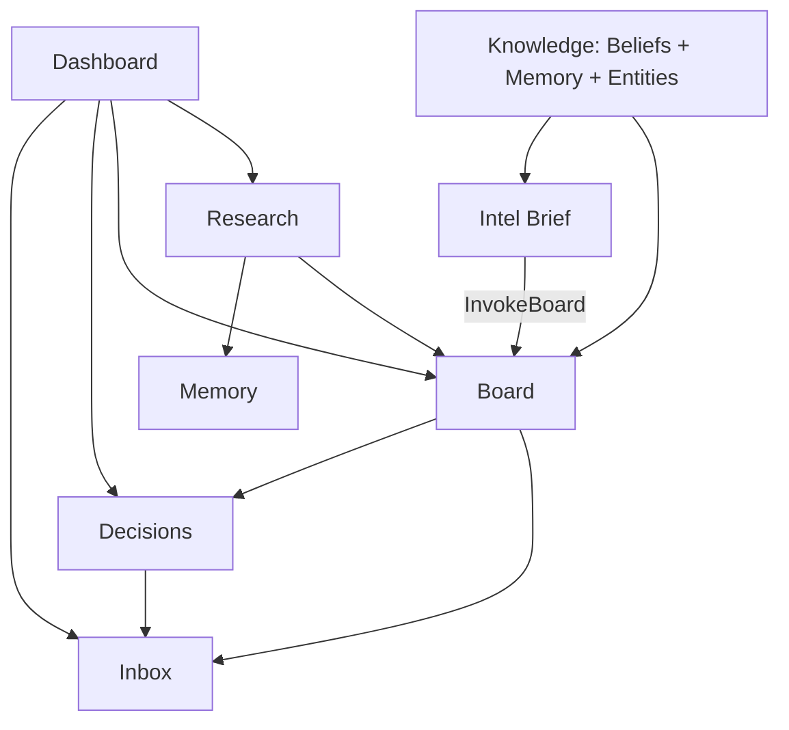
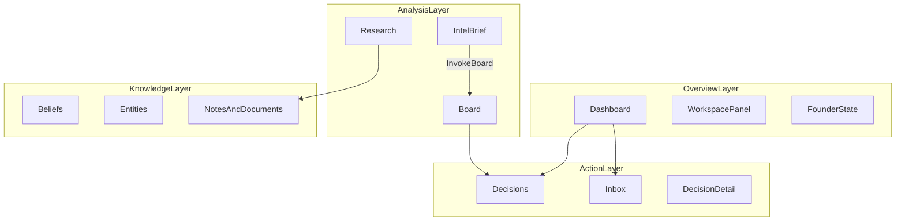
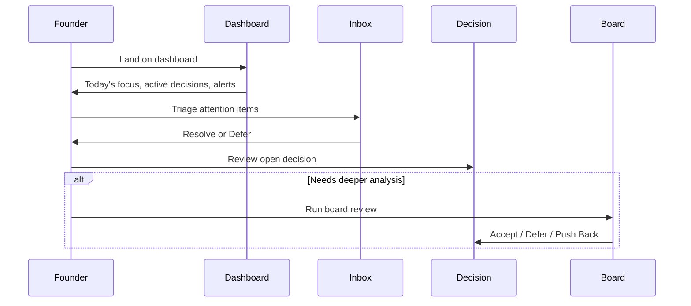

# HelmOS v2 — UX Handover Document

**Audience:** UI/UX developer taking over frontend refactor  
**Last updated:** June 2026  
**Status:** As-built documentation + recommended improvements

This document describes what HelmOS is, how founders are expected to use it, where the current UI creates friction, and what constraints a refactor must preserve. Read this first, then refer to linked technical docs as needed.

---

## Related documentation

| Document | Purpose |
|----------|---------|
| [plan.md](../plan.md) | Master architecture plan; §9 describes original UX vision (partially outdated) |
| [README.md](../README.md) | Quick start, workspaces, keyboard shortcuts |
| [apps/frontend/docs/api-contract.md](../apps/frontend/docs/api-contract.md) | REST + SSE API surface the UI must preserve |
| [apps/backend/README.md](../apps/backend/README.md) | Beliefs vs memory architecture |

---

## 1. Product context

### What HelmOS is

**HelmOS** is a **Founder Intelligence Operating System** with the tagline *evidence before confidence*. It helps a solo founder make strategic decisions using:

- **Memory-grounded chat** (Intel Brief) — Q&A over stored context
- **Adversarial board review** — five AI agents debate a strategic question
- **Web research** — automated entity research pipeline
- **Attention inbox** — items that need founder action
- **Decision log** — persistent record of board outcomes

The founder always makes the final call. AI provides analysis, evidence, and recommendations — never autonomous action.

### Primary persona

Solo founder managing **1–2 workspaces** (companies or ventures). Seed data includes:

- **Clawback Labs** (`clawback-labs`) — B2B compliance/recovery product
- **NexOps** (`nexops`) — operations SaaS with pilot customers

There is **no onboarding wizard or signup flow**. The app assumes a pre-configured founder with API access. MSW mocks the API by default in development.

### Design philosophy (non-negotiable)

These principles are intentional product constraints, not suggestions:

1. **Human-in-the-loop** — Board outcomes require founder action: Accept, Defer, or Push Back
2. **Evidence accessible, never forced** — Confidence scores and source links are visible but collapsed by default
3. **One primary action per screen** — Board has one CTA bar; inbox items have Resolve/Defer
4. **Streaming first** — LLM responses stream token-by-token; avoid blocking spinners where streaming is possible
5. **No dark patterns** — No "are you sure?" modals for non-destructive actions
6. **Workspace context always visible** — Founder should never lose track of which company they're working in

### Key backend concepts the UX must reflect

| Concept | What it is | How it appears in UI today |
|---------|------------|----------------------------|
| **Beliefs** | Founding doctrine — always injected into AI prompts (not vector-retrieved) | Knowledge tab 1; read-only |
| **Memory chunks** | Operational context: notes, docs, research summaries, decision logs | Knowledge tab 3 |
| **Entities** | Company/person/partner cards linked to decisions | Knowledge tab 2 |
| **Board sessions** | 5-agent adversarial review | Board page; creates a Decision |
| **Decisions** | Persistent log of board outcomes with status | Decisions list + detail |
| **Inbox items** | Attention queue spawned by board conflicts, unresolved decisions, etc. | Inbox page + header badge |

**Beliefs vs memory** (critical distinction):

- **Beliefs** live in `strategic_beliefs` table → packed into system prompts via `BeliefService`
- **Memory** lives in `memory_chunks` with pgvector → retrieved semantically via `MemoryService.search()`

A UX refactor should make this distinction understandable to founders, not hide it behind a single undifferentiated "Knowledge" bucket.

### Feature relationships



---

## 2. Current information architecture

### Route map

All authenticated UI lives under `/workspace/[workspaceId]/...`.

| URL path | Sidebar label | Page title / heading | Component |
|----------|---------------|----------------------|-----------|
| `/workspace/{id}/dashboard` | Dashboard | "What matters now" | `dashboard-view.tsx` |
| `/workspace/{id}/decisions` | Decisions | — | `decisions-view.tsx` |
| `/workspace/{id}/decisions/{decisionId}` | — | — | `decision-detail-view.tsx` |
| `/workspace/{id}/board` | Board | — | `board-view.tsx` |
| `/workspace/{id}/memory` | **Knowledge** | "Organizational knowledge" | `memory-view.tsx` |
| `/workspace/{id}/research` | Research | "Research" | `research-view.tsx` |
| `/workspace/{id}/inbox` | Inbox | "Inbox" | `inbox-view.tsx` |
| `/workspace/{id}/brief` | Intel brief | — | `chat-view.tsx` |
| `/workspace/{id}/chat` | — | — | Redirects to `/brief` |
| `/` | — | — | Hard redirect to `/workspace/clawback-labs/dashboard` |

**Not present:** No `/docs`, `/knowledge`, or `/workspace/{id}` index route. Visiting `/workspace/foo` without a child segment returns 404.

### Naming mismatches (as-built)

| User sees | URL / code | Problem |
|-----------|------------|---------|
| "Knowledge" | `/memory` | Route exposes internal term "memory" |
| "Attention" (header) | `/inbox` | Header and sidebar use different labels |
| "Intel brief" (sidebar) | `/brief` | Dashboard and chat empty-state say "Intelligence brief" |
| "Environment" (placeholder) | Workspace selector | Should say workspace name |
| "Organizational knowledge" | Page title on `/memory` | Third label for the same section |

### Conceptual layers

The product organizes into four mental layers. The current sidebar does not reflect this grouping.



### Shell layout

**File:** `apps/frontend/app/workspace/[workspaceId]/layout.tsx`

```
┌─────────────────────────────────────────────────────────────┐
│ Header (header.tsx)                                         │
│  HELMOS · Workspace selector · Founder state · Attention · Theme │
├─────────────────────────────────────────────────────────────┤
│ Workspace panel (workspace-panel.tsx)                       │
│  Metrics + context lines for current workspace              │
├──────────┬──────────────────────────────────────────────────┤
│ Sidebar  │ Main content                                     │
│ (7 items)│ (ScrollablePage or full-height chat)             │
└──────────┴──────────────────────────────────────────────────┘
```

**Header** (`apps/frontend/components/shell/header.tsx`):

- HELMOS logo → current workspace dashboard
- Workspace selector dropdown (placeholder text: "Environment")
- Founder state bar — decision load, blocked, open decisions, research needed (`founder-state.tsx`; hidden below `lg` breakpoint)
- "Attention" link with amber badge → inbox (label differs from sidebar "Inbox")
- Theme toggle

**Sidebar** (`apps/frontend/components/shell/sidebar.tsx`) — 7 items in order:

1. Dashboard
2. Decisions
3. Board
4. Knowledge → `/memory`
5. Research
6. Inbox
7. Intel brief → visually separated with top border

**Keyboard shortcuts** (`apps/frontend/components/keyboard-shortcuts.tsx`):

| Shortcut | Destination |
|----------|-------------|
| Cmd/Ctrl+D | Dashboard |
| Cmd/Ctrl+B | Board |
| Cmd/Ctrl+R | Research |
| Cmd/Ctrl+I | Inbox |

No shortcuts for Decisions, Knowledge, or Intel Brief. Original plan specified Cmd+K for chat focus — not implemented.

### In-page navigation patterns

Only **Knowledge** uses tab UI. Tab state is **not in the URL** — bookmarks and shared links always open the default tab (Strategic beliefs).

| Page | Sub-navigation |
|------|----------------|
| Knowledge | Tabs: Strategic beliefs · Entity cards · Notes & documents |
| Decisions | Button filters: All / open / pursuing / deferred / rejected / resolved |
| Board | Toggle: decision vs exploration mode (not route-based) |
| Inbox | Priority sort only |

---

## 3. Expected user flows

Each flow documents: **trigger → steps → outcome → key files → API endpoints**.

### Flow A: Daily founder loop (primary)

This is the intended daily usage pattern. The product pivoted from "chat-first" (original plan) to **dashboard-first** (current build).



**Steps:**

1. **Land on Dashboard** — `/workspace/{id}/dashboard`
   - See "Today's focus" (inbox priorities per workspace)
   - See active decisions requiring judgment
   - See board alerts (conflicts, risky assumptions, low confidence)
   - See opportunity feed (links to research)

2. **Triage attention**
   - Header "Attention" badge or dashboard "Today's focus" → Inbox
   - Sort by priority (high → medium → low)
   - **Resolve** → status `resolved`
   - **Defer** → status `dismissed` (no date picker; differs from original plan)

3. **Act on decisions**
   - Dashboard cards or Inbox links → Decision detail
   - Review timeline, synthesis, verdict
   - If needed → run new board review

4. **Deep analysis** (when dashboard signals need depth)
   - Board review for adversarial multi-agent analysis
   - Intel Brief for conversational Q&A over stored context

**Entry point:** `/` redirects to `/workspace/clawback-labs/dashboard` (hardcoded; not last-used workspace).

**Key files:**

- `apps/frontend/app/page.tsx`
- `apps/frontend/components/dashboard/dashboard-view.tsx`
- `apps/frontend/components/inbox/inbox-view.tsx`

**APIs:**

- `GET /dashboard` — cross-workspace aggregates (note: URL is workspace-scoped but data is global)
- `GET /founder-state` — header metrics
- `GET /inbox?workspace_id=...`
- `PATCH /inbox/{id}` — resolve/dismiss

---

### Flow B: Strategic question → board → decision

**Trigger:** Founder has a strategic question requiring adversarial review.

**Steps:**

1. Navigate to Board (`/workspace/{id}/board`)
2. Enter strategic question in input field
3. Choose mode:
   - **Decision** — formal decision with Accept/Defer/Push Back
   - **Exploration** — lighter-weight analysis
4. Click run → `POST /board/sessions`
5. Redirect to `/board?session={id}`
6. View 5 agent cards (CTO, Operator, Skeptic, Researcher, Sales Strategist) + synthesis panel
7. Founder action:
   - **Accept** → decision status `pursuing`
   - **Defer** → decision status `deferred`
   - **Push Back** → re-runs board with skepticism prompt prepended to question
8. Side effects: creates Decision record (status `open`); may create Inbox items if verdict is conditional, needs research, lean against, or agents conflict

**Outcome:** Persistent decision in log; possible inbox items for follow-up.

**Key file:** `apps/frontend/components/board/board-view.tsx`

**Related components:**

- `agent-card.tsx` — per-agent verdict and key points
- `synthesis-panel.tsx` — recommendation, risks, unknowns
- `context-trace-panel.tsx` — debug view of injected context (may confuse non-technical users)

**APIs:**

- `POST /board/sessions` — create session
- `GET /board/sessions/{id}` — fetch results
- `PATCH /decisions/{id}` — Accept/Defer status updates

---

### Flow C: Intel Brief → board handoff

**Trigger:** Founder wants to explore a question conversationally before escalating to full board review.

**Steps:**

1. Navigate to Intel Brief (`/workspace/{id}/brief`)
2. Empty state shows suggested prompts (workspace-specific from `suggested-prompts.ts`)
3. Type question → streaming SSE from `POST /chat/stream`
4. Response shows: markdown content, confidence label, evidence accordion (collapsed)
5. Optional: click **Invoke Board** → prefills question in Zustand store → navigates to `/board`
6. Board reads prefill from `useAppStore.boardPrefillQuestion` into question input

**Outcome:** Quick grounded answers; optional escalation to full board session.

**Key files:**

- `apps/frontend/components/chat/chat-view.tsx`
- `apps/frontend/lib/stores/app-store.ts`
- `apps/frontend/lib/suggested-prompts.ts`

**APIs:**

- `POST /chat/stream` — SSE streaming; prompt assembly: beliefs → retrieved memory → user message

**UX note:** Intel Brief is visually demoted in sidebar (border separator) and dashboard copy explicitly says it is "not the default starting point." This is intentional but reduces discoverability.

---

### Flow D: Build organizational context (Knowledge)

**Trigger:** Founder needs to add or browse strategic context that powers board, chat, and research.

**Current structure:** Three tabs on `/memory`, no deep URLs.

| Tab | Content | User actions | API |
|-----|---------|--------------|-----|
| Strategic beliefs | Founding principles, confidence, override conditions | **Read-only** (API supports CRUD; UI does not) | `GET /beliefs` |
| Entity cards | Companies, people, partners | View summary, research age, linked decisions | `GET /entities` |
| Notes & documents | Memory chunks | Search, filter by type, add note, **upload PDF/TXT/MD** | `GET/POST /memory/chunks`, `POST /memory/ingest` |

**Chunk types** (for Notes & documents filters):

- `strategy_note`
- `research_summary`
- `decision_log`
- `document_chunk`

`entity_profile` chunks are filtered out of the notes list (shown via Entity cards tab instead).

#### Documents are buried (P0 issue)

Document upload and browsing requires:

1. Sidebar → **Knowledge**
2. Tab → **Notes & documents** (third tab, not default)
3. File upload control within that tab

There is:

- No `/docs` route
- No sidebar entry for documents
- No dashboard link to uploads
- No empty-state CTA prompting founders to upload context
- No URL to bookmark the documents view

**Recommended user mental model:** "Upload my pitch deck / strategy doc so the board can reference it" — currently requires knowing an obscure navigation path.

**Key file:** `apps/frontend/components/memory/memory-view.tsx`

**APIs:**

- `GET /beliefs?workspace_id=...`
- `GET /entities?workspace_id=...`
- `GET /memory/chunks?workspace_id=...&type=...&search=...`
- `POST /memory/chunks` — add note (always `strategy_note` type)
- `POST /memory/ingest` — file upload

---

### Flow E: Entity research

**Trigger:** Founder needs fresh web research on a company or entity.

**Steps:**

1. Navigate to Research (`/workspace/{id}/research`)
2. Enter entity name (default: "Acme Corp")
3. Click "Run research" → `POST /research/run`
4. Poll `GET /research/status/{jobId}` every 1.2s
5. Step progress UI: Querying → Searching → Extracting → Summarizing → Done
6. View sources with URL and snippet when complete
7. Output feeds memory as `research_summary` and entity profiles

**Outcome:** Updated entity knowledge available to board and chat.

**Key file:** `apps/frontend/components/research/research-view.tsx`

**APIs:**

- `POST /research/run` — body: `{ entity_name, workspace_id }` only
- `GET /research/status/{id}`

**Known issue:** UI shows editable "Queries" fields and "Add query" button, but `runResearch` only sends `entity_name` and `workspace_id`. Query customization is decorative and misleading.

---

### Flow F: Decision lifecycle

**Trigger:** Founder tracks outcomes of board sessions over time.

**List view** (`/workspace/{id}/decisions`):

- Filter by status: All / open / pursuing / deferred / rejected / resolved
- Export decisions as markdown
- Click card → detail view

**Detail view** (`/workspace/{id}/decisions/{decisionId}`):

- Decision title, status badge, verdict badge
- Timeline of lifecycle stages
- Synthesis panel (reused from board)
- Link to run new board review

**Key files:**

- `apps/frontend/components/decisions/decisions-view.tsx`
- `apps/frontend/components/decisions/decision-detail-view.tsx`
- `apps/frontend/components/decisions/decision-timeline.tsx`
- `apps/frontend/components/shared/synthesis-panel.tsx`

**APIs:**

- `GET /decisions?workspace_id=...`
- `GET /decisions/{id}`
- `PATCH /decisions/{id}` — status updates

---

## 4. UX problems catalog

Prioritized for refactor planning. **P0** blocks usability; **P1** causes confusion; **P2** is polish or planned gaps.

### P0 — Discoverability and broken expectations

| Issue | Current state | User impact |
|-------|---------------|-------------|
| **Documents buried** | PDF/MD upload under Knowledge → tab 3 | Founders won't find doc ingestion; feels like an afterthought |
| **Knowledge tab state not in URL** | Default tab = beliefs; bookmarks always open beliefs | Can't link or share "documents" view |
| **Research query fields decorative** | UI shows editable queries; API only sends `entity_name` | User thinks they're customizing research; changes have no effect |
| **Beliefs read-only in UI** | API supports POST/PATCH/DELETE; UI is display-only | Can't manage founding doctrine without direct API calls |

### P1 — Naming and IA inconsistency

| Issue | Examples |
|-------|----------|
| Route vs label mismatch | Sidebar "Knowledge" → URL `/memory` |
| Attention vs Inbox | Header "Attention", sidebar "Inbox", page title "Inbox" |
| Intel brief vs Intelligence brief | Sidebar "Intel brief"; dashboard and chat say "Intelligence brief" |
| Workspace selector placeholder | Shows "Environment" instead of workspace name |
| Dashboard scope confusion | URL is workspace-scoped; `GET /dashboard` returns cross-workspace data |

### P1 — Hierarchy and demotion

| Issue | Detail |
|-------|--------|
| Intel brief visually demoted | Border separator in sidebar; copy says "not the default starting point" |
| Founder state hidden on mobile | `FounderStateBar` only visible at `lg+` breakpoint |
| Incomplete keyboard shortcuts | No shortcuts for Decisions, Knowledge, Brief; Cmd+K not implemented |

### P2 — Missing features and planned gaps

- No onboarding or auth UI (API key only)
- Projects API exists (`GET /workspaces/{id}/projects`) but no UI — memory API accepts `project_id` filter but frontend never uses it; `projectId` in Zustand store is unused in views
- Hardcoded home redirect to `clawback-labs` (not last-used workspace from persisted store)
- `/workspace/{id}` without child segment 404s despite sidebar treating bare workspace path as dashboard-active
- Inbox "Defer to [date]" from original plan not implemented — Defer just dismisses
- Original plan had Chat as default view; product intentionally pivoted to Dashboard-first

### P2 — Functional and UI debt

- Chunk type filter labels use `t.replace("_", " ")` — only replaces first underscore
- No empty-state guidance on Knowledge tabs (what should a new founder add first?)
- Context trace panel on Board is debug-oriented — may confuse non-technical founders
- Research page subtitle says "(mock)" even when wired to real API

---

## 5. Recommended IA and navigation fixes

Suggestions for the UX developer to refine — not prescriptive implementation orders.

### A. Elevate documents to first-class

**Problem:** Document upload is three clicks deep with no way to link directly.

**Options** (pick one or combine):

- Add **Documents** as a sidebar item → `/documents` or `/memory/documents`
- Split Knowledge into **Beliefs**, **Entities**, **Library** (docs + notes) as separate nav items
- Dashboard CTA: "Upload context" when workspace has zero `document_chunk` entries
- Deep-linkable tab URLs: `/memory?tab=documents` or `/memory/documents`

**Success criteria:** A founder can upload a PDF within one click from dashboard or sidebar, and share a URL that opens the documents view.

### B. Unify naming glossary

| Concept | Recommended user-facing term | Avoid in UI |
|---------|------------------------------|-------------|
| Memory route | Knowledge or Library | "Memory" |
| Inbox | Inbox (use everywhere) | "Attention" in header only |
| Chat feature | Intel Brief (pick one spelling) | Mixing "Intel" and "Intelligence" |
| Workspaces | Workspaces | "Environment" |
| Page title | Match sidebar label | "Organizational knowledge" if sidebar says "Knowledge" |

### C. Re-tier sidebar by mental model

Current flat list does not reflect how founders think. Proposed grouping for wireframes:

| Group | Items | Rationale |
|-------|-------|-----------|
| **Today** | Dashboard, Inbox | What needs attention now |
| **Decide** | Decisions, Board | Commitment and adversarial review |
| **Learn** | Research, Intel Brief | Gather and explore information |
| **Context** | Beliefs, Entities, Documents | Foundational knowledge that powers everything |

Alternative: keep single Knowledge entry but with persistent sub-nav (not tabs) and routable URLs.

### D. Fix dashboard / workspace relationship

**Current behavior:** URL includes `workspaceId` but dashboard API returns cross-workspace aggregates.

**Choose one model and make it obvious in UI:**

| Model | UI treatment | Backend change |
|-------|--------------|----------------|
| **Global mission control** (current API) | Remove workspace from dashboard URL, or show "All workspaces" badge prominently | None |
| **Workspace-scoped dashboard** | Filter all dashboard sections to current workspace | `GET /dashboard?workspace_id=...` |

Recommend picking one and documenting it in the dashboard header so founders aren't confused about scope.

### E. Complete keyboard shortcuts

Align with original plan intent:

| Shortcut | Action |
|----------|--------|
| Cmd/Ctrl+K | Focus Intel Brief input (global command palette optional) |
| Cmd/Ctrl+Shift+D | Decisions |
| Cmd/Ctrl+Shift+M | Knowledge / Library |

Keep existing Cmd+D/B/R/I shortcuts.

### F. Surface founder state on all breakpoints

Show decision load and blocked count as compact pills in header on mobile. Critical signals are currently hidden below `lg`.

### G. Fix or remove misleading UI

| Element | Recommendation |
|---------|----------------|
| Research query fields | Remove until API supports custom queries, or wire them up |
| Context trace panel | Move behind "Advanced" toggle or dev-only mode |
| Beliefs tab | Add create/edit UI (API ready) or explain why read-only |

---

## 6. Constraints for the UX developer

### Preserve (backend contracts)

These patterns must survive a UI refactor:

| Contract | Detail |
|----------|--------|
| Route prefix | All pages under `/workspace/[workspaceId]/...` |
| Board session | Results via `?session={id}` query param on `/board` |
| Chat → Board handoff | Zustand `boardPrefillQuestion` in `app-store.ts` |
| API client | Refactor UI around `apps/frontend/lib/api/client.ts` — do not duplicate fetch logic |
| Chat streaming | SSE via `streamChat()` — token-by-token rendering |
| Research polling | Poll `GET /research/status/{id}` until `step === "done"` |
| Workspace persistence | `workspaceId` in Zustand persist store |

### Safe to change freely

- Labels, nav order, grouping, visual hierarchy
- Tab → route migration (e.g. `/memory/beliefs`, `/memory/documents`)
- Empty states, onboarding hints, first-run guidance
- Component layout within views (keep data-fetching hooks; relocate presentation)
- Sidebar grouping, header layout, mobile navigation patterns
- Color, typography, spacing (Tailwind tokens)

### Requires backend coordination

Flag these for engineering; don't block pure UI work, but UI alone cannot fully deliver:

| Feature | Status |
|---------|--------|
| Belief CRUD UI | API ready (`POST/PATCH/DELETE /beliefs`) |
| Research custom queries | API may need extension; UI fields exist but unused |
| Inbox defer-with-date | API currently only supports resolve/dismiss |
| Dashboard workspace scoping | API returns global data; needs `workspace_id` filter |
| Projects scoping UI | `GET /workspaces/{id}/projects` exists; no frontend usage |

### Tech stack (stay in)

- **Next.js 14** App Router
- **Tailwind CSS** + **shadcn/ui** components
- **TanStack Query** for data fetching and cache invalidation
- **Zustand** for global state (workspace, board prefill)
- **Vercel AI SDK** patterns for streaming (where used)

### Reusable shared components

Refactor around these; don't rebuild from scratch:

| Component | Path | Used for |
|-----------|------|----------|
| Evidence accordion | `components/shared/evidence-accordion.tsx` | Chat, board evidence |
| Confidence label | `components/shared/confidence-label.tsx` | Chat responses |
| Synthesis panel | `components/shared/synthesis-panel.tsx` | Board, decision detail |
| Section header | `components/shared/section-header.tsx` | Page sections |
| Decision status badge | `components/shared/decision-status-badge.tsx` | Decisions, dashboard |
| Verdict badge | `components/shared/verdict-badge.tsx` | Board, decisions |
| Scrollable page | `components/shell/scrollable-page.tsx` | Layout wrapper |

---

## 7. Feature → file → API quick reference

Use this table to navigate the codebase.

| Surface | Route | Page file | View component | Primary APIs |
|---------|-------|-----------|--------------|--------------|
| Dashboard | `/dashboard` | `app/workspace/[workspaceId]/dashboard/page.tsx` | `components/dashboard/dashboard-view.tsx` | `GET /dashboard`, `GET /founder-state` |
| Decisions list | `/decisions` | `.../decisions/page.tsx` | `components/decisions/decisions-view.tsx` | `GET /decisions` |
| Decision detail | `/decisions/[id]` | `.../decisions/[decisionId]/page.tsx` | `components/decisions/decision-detail-view.tsx` | `GET /decisions/{id}`, `PATCH /decisions/{id}` |
| Board | `/board` | `.../board/page.tsx` | `components/board/board-view.tsx` | `POST/GET /board/sessions` |
| Knowledge | `/memory` | `.../memory/page.tsx` | `components/memory/memory-view.tsx` | `GET /beliefs`, `GET /entities`, `GET/POST /memory/*` |
| Research | `/research` | `.../research/page.tsx` | `components/research/research-view.tsx` | `POST /research/run`, `GET /research/status/{id}` |
| Inbox | `/inbox` | `.../inbox/page.tsx` | `components/inbox/inbox-view.tsx` | `GET /inbox`, `PATCH /inbox/{id}` |
| Intel Brief | `/brief` | `.../brief/page.tsx` | `components/chat/chat-view.tsx` | `POST /chat/stream` |

### Shell and infrastructure

| Concern | File |
|---------|------|
| Root layout | `app/layout.tsx` |
| Workspace layout | `app/workspace/[workspaceId]/layout.tsx` |
| Sidebar | `components/shell/sidebar.tsx` |
| Header | `components/shell/header.tsx` |
| Workspace panel | `components/shell/workspace-panel.tsx` |
| Founder state | `components/shell/founder-state.tsx` |
| Keyboard shortcuts | `components/keyboard-shortcuts.tsx` |
| API client | `lib/api/client.ts` |
| Types | `lib/types/index.ts` |
| Global store | `lib/stores/app-store.ts` |
| Suggested prompts | `lib/suggested-prompts.ts` |

### Backend orchestration (for context)

| Concern | File |
|---------|------|
| Board orchestration | `apps/backend/orchestrator/board.py` |
| Context assembly | `apps/backend/orchestrator/context_builder.py` |
| Research pipeline | `apps/backend/research/pipeline.py` |
| Beliefs service | `apps/backend/beliefs/service.py` |
| Memory retrieval | `apps/backend/memory/retrieval.py` |

---

## 8. Appendix: Original vision vs current build

From [plan.md](../plan.md) §9. Helps distinguish intentional product shifts from accidental drift.

| plan.md §9 (original) | Current build | Notes |
|-----------------------|---------------|-------|
| Chat as default view | Dashboard as default | **Intentional pivot** — dashboard copy reinforces this |
| Sidebar: Chat, Board, Memory, Research, Inbox, Decisions | Dashboard first; Chat renamed Intel brief, demoted | Reorder reflects new priority |
| Cmd+K chat focus | Not implemented | Gap |
| Memory as flat chunk list | Tabbed: beliefs / entities / notes | Better organization, worse deep-linking |
| Inbox "Defer to [date]" | Defer = dismiss only | Gap |
| Entity cards grouped in memory | Separate tab | Improvement |
| Intent classifier auto-routing | Manual navigation | Orchestrator routing not built |
| Belief CRUD in UI | Read-only display | API ready, UI gap |

### UX principles from plan.md (still valid)

1. Streaming first
2. Evidence accessible but collapsed by default
3. One primary action per screen
4. Keyboard-first navigation
5. Workspace switcher always visible
6. No dark-pattern confirmation modals

---

## 9. Suggested first steps for UX developer

1. **Run the app** — `cd apps/frontend && pnpm dev`; explore both workspaces (Clawback Labs, NexOps)
2. **Walk each flow** in §3 end-to-end; note friction points firsthand
3. **Prioritize P0 issues** — especially document discoverability and misleading research UI
4. **Propose IA wireframes** using §5 groupings before touching code
5. **Align on dashboard scope** (global vs workspace) with product owner before redesigning
6. **Preserve API contracts** in §6 while refactoring navigation and layout

Questions about backend behavior: see [api-contract.md](../apps/frontend/docs/api-contract.md) and [apps/backend/README.md](../apps/backend/README.md).
